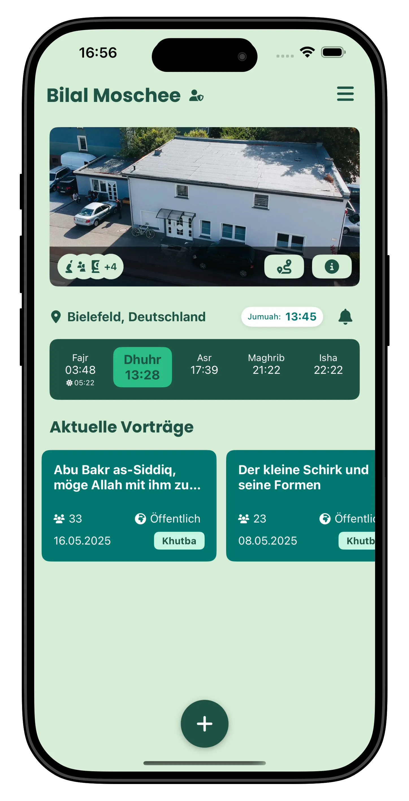
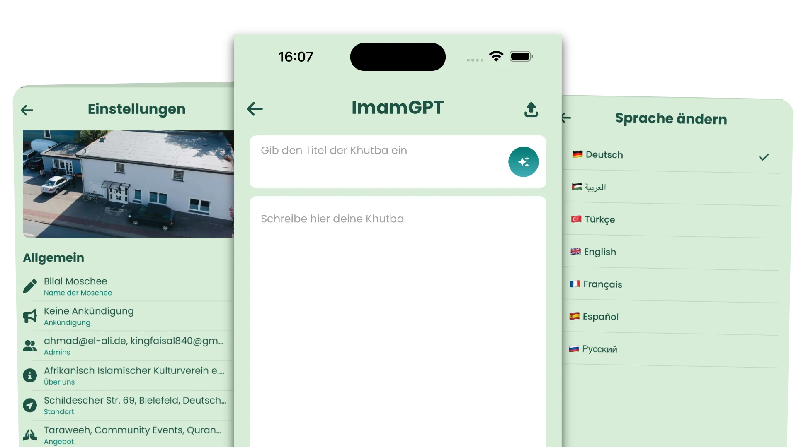
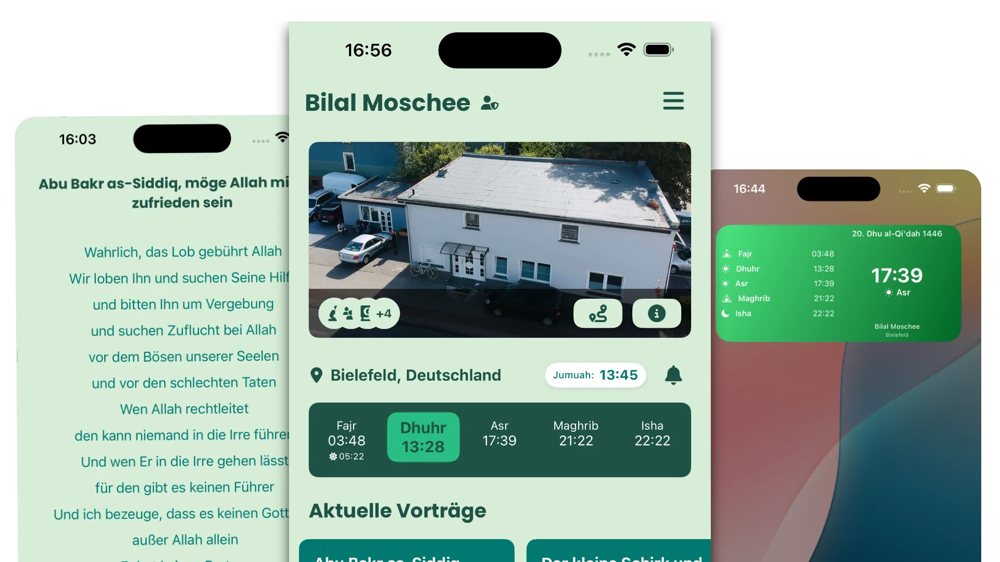

# Projektdokumentation: Entwicklung einer modernen Webplattform für Moscheen

## 1. Einleitung

Die Deenly-Webseite ist die Landingpage der Deenly-App, die mit dem Hauptziel entwickelt wurde, Sprachbarrieren für Nicht-Muttersprachler zu überwinden, die die Sprache des Imams während der Freitagspredigt nicht sprechen oder verstehen. Es gibt weltweit ein großes Problem mit Sprachbarrieren, das viele muslimische Gemeinschaften betrifft.

Unser Unternehmen AE-Software erhielt von einer Moschee in Bielefeld den Auftrag, eine neue Technologie zu entwickeln, die den Menschen hilft zu verstehen, welche Predigt der Imam hält. Die meisten Predigten werden traditionell auf Arabisch und in der Sprache der jeweiligen Gemeinschaft gehalten. Eine Person aus einem anderen Land, die weder Arabisch noch die lokale Sprache versteht, wird von der Predigt nichts verstehen.

Deshalb hat unser Unternehmen eine Anwendung entwickelt, die die Freitagspredigten des Imams in sieben verschiedene Sprachen übersetzt. Der Imam schreibt seine Predigt und speichert sie auf der von uns erstellten Seite – diese wird dann automatisch in sieben Sprachen übersetzt, um ein besseres Verständnis zu ermöglichen.

Die Anwendung befindet sich zwar noch in einer frühen Entwicklungsphase, hat aber bereits viel Anerkennung von verschiedenen Moscheen und Gemeinschaften erhalten.

### 1.1 Projektbeschreibung

Das Projekt umfasst die Entwicklung einer modernen, benutzerfreundlichen Webplattform, die speziell für Moscheen konzipiert ist. Diese Plattform ermöglicht es Moscheen, aktuelle Informationen, Gebetszeiten und Khutbas (Freitagspredigten) in mehreren Sprachen bereitzustellen. Ziel ist es, die Bedürfnisse einer vielfältigen Gemeinschaft zu adressieren, insbesondere derjenigen mit Sprachbarrieren. Die Plattform wird moderne Technologien nutzen, um Zugänglichkeit und Benutzerengagement zu gewährleisten.

### 1.2 Projektziel

Das Hauptziel des Projekts ist die Schaffung einer digitalen Lösung, die die Kommunikation und Informationsverbreitung innerhalb der Moscheegemeinschaft erleichtert. Zu den spezifischen Zielen gehören:

- Bereitstellung einer Echtzeitübersetzung von Khutbas in mehrere Sprachen.
- Einfacher Zugang zu Gebetszeiten und anderen Gemeindediensten.
- Verbesserung des Gemeinschaftsengagements durch eine responsive und interaktive Plattform.

### 1.3 Projektumfeld

Das Projekt wird in Zusammenarbeit mit AE-Software durchgeführt, einem Unternehmen, das auf IT-Entwicklung und E-Learning-Lösungen spezialisiert ist. Die Zielgruppe umfasst:

- Muslime, die die Landessprache nicht verstehen.
- Junge Muslime, die eine digitale Verbindung zu ihrer Moschee suchen.
- Imame, die ihre Inhalte effektiver verbreiten möchten.
- Moscheevereine, die ihre Angebote modernisieren möchten.

### 1.4 Projektbegründung

Das Projekt ist notwendig, um Sprachbarrieren zu überwinden, die eine effektive Kommunikation innerhalb von Moscheen behindern. Viele Gemeindemitglieder haben Schwierigkeiten, die in der Landessprache gehaltenen Predigten zu verstehen, was zu einer Entfremdung führen kann. Durch die Bereitstellung mehrsprachiger Inhalte zielt die Plattform darauf ab, Inklusivität zu fördern und das spirituelle Erlebnis für alle Gemeinschaftsmitglieder zu verbessern.

### 1.5 Projektschnittstellen

Das Projekt wird mit verschiedenen Stakeholdern interagieren, darunter:

- **Moschee-Administratoren:** Um Anforderungen und Feedback zu sammeln.
- **Imame:** Um sicherzustellen, dass die Plattform ihren Bedürfnissen zur Predigtübermittlung entspricht.
- **Gemeindemitglieder:** Um ihre Präferenzen und Anforderungen für den Zugang zu Informationen zu verstehen.
- **Technisches Team:** Für Entwicklung, Wartung und Support.

### 1.6 Projektabgrenzung

Der Projektumfang umfasst das Design, die Entwicklung und die Implementierung der Webplattform. Folgendes ist enthalten:

- Benutzeroberflächendesign und Überlegungen zur Benutzererfahrung.
- Backend-Entwicklung für Inhaltsverwaltung und Übersetzungsdienste.
- Integration von Funktionen wie Gebetszeitbenachrichtigungen und archivierten Predigten.

**Ausgeschlossen:** Das Projekt umfasst keine physischen Infrastrukturverbesserungen in Moscheen oder die Entwicklung von Inhalten für Predigten.

## 1.7 Visualisierungen und Abbildungen

Um die Dokumentation anschaulicher zu gestalten, werden im Folgenden relevante Bilder und Diagramme eingebunden:

### Projektlogo

### Beispiel: Startseite der Anwendung

### Feature-Illustration: Moschee-Funktionen

### Feature-Illustration: Ummah-Community

### Architekturdiagramm (Beispiel)

*Hier kann ein Architekturdiagramm eingefügt werden, z.B. aus draw.io oder Figma exportiert als PNG/SVG:*

### ER-Diagramm (Beispiel)

*Hier kann ein ER-Diagramm der Datenbank eingefügt werden:*

---

## 2. Projektplanung

Die Projektplanung für Deenly Web bildet die Grundlage für eine erfolgreiche Ausführung, indem Phasen, Ressourcenanforderungen und ein strukturierter Entwicklungsprozess klar definiert werden, der mit agilen Methoden übereinstimmt.

### 2.1 Projektphasen

1. **Analysephase**
   - **Ist-Analyse (Aktueller Stand):**
     - Bewertung der aktuellen Barrieren in der Kommunikation von Moscheen, insbesondere für Nicht-Muttersprachler.
     - Identifizierung technologischer Lücken in bestehenden Lösungen für die Live-Übersetzung von Khutbas und das Engagement der Moscheen.
   - **Anforderungserhebung:**
     - Durchführung von Interviews mit Imamen, Moschee-Administratoren und Gemeindemitgliedern.
     - Definition der Hauptanwendungsfälle: Verwaltung von Gebetszeiten, Übersetzung von Predigten, Bekanntmachungen der Gemeinde und KI-generierte Khutbah-Tools.
     - Erfassung der Lokalisierungsbedürfnisse (Unterstützung für 10+ Sprachen).

2. **Planungsphase**
   - **Projekt-Roadmap:**
     - Festlegung wichtiger Meilensteine und Ergebnisse.
     - Definition der Sprintzeitpläne (zweiwöchentliche Sprints für agile Ausführung).
   - **Risikobewertung:**
     - Identifizierung potenzieller Risiken (z.B. Mehrsprachigkeit, Echtzeit-Synchronisierung) und Strategien zur Minderung.
   - **Zeitrahmen:**
     - Schätzung der Dauer für jede Phase, mit Pufferzeit für Tests und Überarbeitungen.

3. **Entwurfsphase**
   - **Wireframing:**
     - Skizzierung der Benutzerflüsse für die App-Startseite, Funktionsbeschreibungen, FAQs und das Moschee-Dashboard.
     - Definition responsiver UI-Layouts (mobile-first, Tablet, Desktop).
   - **UI/UX-Design:**
     - Auswahl zugänglicher Farben (Grüntöne für das Deen-Thema), Schriftartenhierarchie und Ikonographie.
     - Gestaltung interaktiver Elemente (Sprachumschalter, Dunkel-/Hell-Modus, Accordion-FAQ).
     - Verwendete Tools: Figma, Adobe XD.

4. **Implementierungsphase**
   - **Frontend:**
     - Framework: React mit TypeScript und Vite.
     - Funktionen: dynamische Übersetzungen (i18n), responsive Karussell-Modalfenster, Themenumschaltung, Akkordeons.
     - Styling: CSS-Module + benutzerdefinierte Themen + Tailwind-ähnliche Utility-Klassen.
   - **Backend:**
     - Echtzeit-Synchronisierungslogik für Live-Khutbah (geplant für Phase 2).
     - Zukünftige APIs zur Verwaltung von Moscheedaten und Gebetsplänen.
   - **Mobile Integration:**
     - Unterstützung für Deep Linking zu App Store / Google Play-Abzeichen.

5. **Testphase**
   - **Qualitätssicherung:**
     - Cross-Browser- und Gerätekompatibilitätstests.
     - Unit- und Integrationstests für Formularübermittlung, Sprachumschaltung und Themenverhalten.
   - **Benutzertests:**
     - Feedback von Imamen und lokalen Gemeinden einholen.
     - Usability-Sitzungen in verschiedenen Sprachen.

6. **Bereitstellungsphase**
   - **Live-Bereitstellung:**
     - Hosting über Vercel oder Netlify.
     - CDN-Bereitstellung für optimiertes Laden von Assets.
   - **App-Start:**
     - Veröffentlichung auf iOS und Android.
     - Abschließende SEO- und Zugänglichkeitsprüfungen.
   - **Schulung:**
     - Dokumentation für Moschee-Administratoren.
     - Onboarding-Video oder Schnellstartanleitung.

7. **Wartungsphase**
   - **Überwachung:**
     - Uptime-Überwachung und Fehlerverfolgung (z.B. mit Sentry, Vercel Insights).
   - **Updates:**
     - Hinzufügen neuer Funktionen (z.B. KI-Khutbah-Bibliothek).
     - Erweiterung der Übersetzungsabdeckung (z.B. Somali, Urdu, Hausa, Bengali).
   - **Support:**
     - Bereitstellung eines Kontaktformulars und eines responsiven Feedbackkanals.

### 2.2 Ressourcenplanung

**Personelle Ressourcen**
- Frontend-Entwickler: React, i18n, Tailwind/CSS.
- UI/UX-Designer: Prototyping und Schnittstellendesign.
- Inhaltübersetzer: Für 10+ Sprachen (Muttersprachler bevorzugt).
- QA/Testern: Manuelle und automatisierte Testausführung.
- Projektmanager: Sprintplanung und Kommunikation.
- Berater: Imame und Gelehrte für theologische Genauigkeit.

**Technische Ressourcen**
- Frontend-Stack: React, Vite, i18next, SwiperJS.
- Backend-Stack (geplant): Node.js, Express, MongoDB (oder Firebase).
- Hosting: Vercel (Frontend), Supabase oder AWS (Backend).
- CI/CD: GitHub Actions oder Vercel-Pipeline.
- Überwachung: Sentry, Google Analytics, Lighthouse.

**Finanzielle Ressourcen**
- Entwicklungskosten: Löhne für Dev-/Design-Team.
- Infrastruktur: Domain, Hosting, Drittanbieter-APIs.
- Marketing: App-Store-Optimierung, bezahlte Anzeigen für den Start.
- Lokalisierung: Menschliche Übersetzung für rechtliche und religiöse Genauigkeit.

### 2.3 Entwicklungsprozess

**Agile Methodik**
- **Sprint-Planung:**
  - Definieren von Backlog-Elementen und Sprint-Zielen (z.B. „Implementierung des Live-Übersetzungs-Popups“).
  - Schätzungen mit Story-Punkten.
- **Tägliche Stand-ups:**
  - Kurze Synchronisation, um Fortschritte, Blockaden und den Plan für den Tag zu besprechen.
- **Sprint-Reviews:**
  - Präsentation der abgeschlossenen Arbeiten.
  - Feedback von Stakeholdern (z.B. Moschee-Vertretern) einholen.
- **Sprint-Retrospektiven:**
  - Besprechen, was gut gelaufen ist, was nicht und Verbesserungen für den nächsten Sprint.
- **Versionskontrolle:**
  - Git mit GitHub. Feature-Branches mit Pull-Requests und Code-Review.
- **Continuous Integration:**
  - Automatisches Erstellen bei Commit; automatisches Bereitstellen in der Staging-Umgebung.

## 3. Analysephase

Die Analysephase konzentriert sich auf das Verständnis der aktuellen Situation und die Bewertung der Machbarkeit des Projekts.

### 3.1 Ist-Analyse

Die Ist-Analyse bewertet den aktuellen Stand der Kommunikation und Informationsverbreitung in Moscheen. Dies umfasst:

- Bewertung bestehender Plattformen und deren Einschränkungen.
- Sammlung von Feedback von Gemeindemitgliedern und Moschee-Administratoren.

### 3.2 Wirtschaftlichkeitsanalyse

Dieser Abschnitt bewertet die finanziellen Implikationen des Projekts.

#### 3.2.1 „Make or Buy“-Entscheidung

Eine Analyse wird durchgeführt, um zu bestimmen, ob die Plattform intern entwickelt oder bestehende Lösungen gekauft werden sollen. Zu berücksichtigende Faktoren sind:

- Kostenvergleich zwischen Entwicklung und Kauf.
- Langfristige Wartung und Skalierbarkeit.

#### 3.2.2 Projektkosten

Eine detaillierte Aufschlüsselung der Projektkosten wird bereitgestellt, einschließlich:

- Entwicklungskosten (Personal, Technologie, Werkzeuge).
- Marketing- und Betriebskosten.

#### 3.2.3 Amortisationsdauer

Die Amortisationsdauer wird berechnet, um zu bestimmen, wie lange es dauert, bis das Projekt finanziell tragfähig wird. Dies umfasst Prognosen zum Nutzerwachstum und zur Einnahmengenerierung.

### 3.3 Nicht-monetäre Vorteile

Neben den finanziellen Überlegungen bietet das Projekt mehrere nicht-monetäre Vorteile, wie:

- Erhöhtes Gemeinschaftsengagement und -teilnahme.
- Verbesserter Zugang zu religiöser Bildung und Ressourcen.
- Erhöhte Sichtbarkeit von Moscheen im digitalen Raum.

### 3.4 Anwendungsfälle

Anwendungsfälle werden entwickelt, um zu veranschaulichen, wie verschiedene Stakeholder mit der Plattform interagieren werden. Beispiele sind:

- Ein Gemeindemitglied greift auf übersetzte Khutbas zu.
- Ein Imam lädt Predigtinhalte hoch und verwaltet Gebetszeiten.

### 3.5 Lastenheft/Fachkonzept

Ein detailltes Lastenheft wird erstellt, das sowohl funktionale als auch nicht-funktionale Anforderungen umreißt. Dies dient als Leitfaden für den Entwicklungsprozess und stellt sicher, dass alle Anforderungen der Stakeholder erfüllt werden.

### 3.6 Aktuelle Situation in Moscheen

*Hier kann eine Analyse der aktuellen Situation in Moscheen eingefügt werden, z.B. Herausforderungen bei der Informationsverbreitung, Feedback aus Interviews, etc.*

## 4. Entwurfsphase

Die Entwurfsphase ist entscheidend für die Entwicklung der Webplattform. In dieser Phase werden die technischen und funktionalen Details des Projekts festgelegt.

### 4.1 Zielplattform

Die Zielplattform beschreibt die technischen Rahmenbedingungen, auf denen die Anwendung betrieben wird. Für die Deenly Webplattform werden folgende Punkte berücksichtigt:

- **Webtechnologien:** Die Plattform wird als webbasierte Anwendung entwickelt, die auf allen gängigen Browsern (Chrome, Firefox, Safari, Edge) funktioniert.
- **Mobilgeräte:** Die Anwendung wird responsiv gestaltet, um eine optimale Nutzung auf Smartphones und Tablets zu gewährleisten.
- **Betriebssysteme:** Die Plattform wird plattformunabhängig sein und sowohl auf Windows als auch auf macOS sowie auf mobilen Betriebssystemen wie iOS und Android funktionieren.

### 4.2 Architekturdesign

Das Architekturdesign beschreibt die strukturelle Gestaltung der Anwendung. Hierbei werden die folgenden Aspekte berücksichtigt:

- **Client-Server-Architektur:** Die Anwendung wird in einer typischen Client-Server-Architektur aufgebaut, wobei das Frontend (Benutzeroberfläche) und das Backend (Serverlogik und Datenbank) getrennt sind.
- **Microservices:** Es wird erwogen, die Anwendung in Microservices zu unterteilen, um eine bessere Skalierbarkeit und Wartbarkeit zu gewährleisten.
- **API-Design:** RESTful APIs werden entwickelt, um die Kommunikation zwischen Frontend und Backend zu ermöglichen.

### 4.3 Entwurf der Benutzeroberfläche

Der Entwurf der Benutzeroberfläche (UI) konzentriert sich auf die Benutzererfahrung (UX) und die visuelle Gestaltung der Anwendung. Wichtige Punkte sind:

- **Wireframes:** Erstellung von Wireframes zur Visualisierung der Benutzeroberfläche und der Navigation.
- **Design-Richtlinien:** Festlegung von Design-Richtlinien, einschließlich Farbpaletten, Schriftarten und Layouts, um eine konsistente Benutzererfahrung zu gewährleisten.
- **Interaktive Prototypen:** Entwicklung interaktiver Prototypen, um das Benutzererlebnis zu testen und Feedback von Stakeholdern zu sammeln.

### 4.4 Datenmodell

Das Datenmodell beschreibt die Struktur der Daten, die in der Anwendung verwendet werden. Wichtige Punkte sind:

- **Entitäten:** Definition der Hauptentitäten (z.B. Benutzer, Khutbas, Gebetszeiten) und deren Attribute.
- **Beziehungen:** Festlegung der Beziehungen zwischen den Entitäten (z.B. ein Benutzer kann mehrere Khutbas kommentieren).
- **Datenbankdesign:** Erstellung eines Entity-Relationship-Diagramms (ER-Diagramm), um die Datenstruktur visuell darzustellen.

### 4.5 Geschäftslogik

Die Geschäftslogik definiert die Regeln und Abläufe, die die Funktionsweise der Anwendung steuern. Wichtige Aspekte sind:

- **Regeln für die Benutzerregistrierung:** Definition der Kriterien für die Registrierung und Authentifizierung von Benutzern.
- **Verwaltung von Inhalten:** Festlegung der Abläufe zur Erstellung, Bearbeitung und Löschung von Khutbas und anderen Inhalten.
- **Übersetzungslogik:** Implementierung der Logik zur Echtzeitübersetzung von Khutbas in die gewünschten Sprachen.

### 4.6 Pflichtenheft

Das Pflichtenheft ist ein Dokument, das die funktionalen und nicht-funktionalen Anforderungen der Anwendung detailliert beschreibt. Es dient als Leitfaden für die Entwicklung und stellt sicher, dass alle Stakeholder-Anforderungen erfüllt werden. Wichtige Punkte sind:

- **Funktionale Anforderungen:** Detaillierte Beschreibung der Funktionen, die die Anwendung bieten muss (z.B. Benutzerregistrierung, Live-Übersetzung, Zugriff auf Gebetszeiten).
- **Nicht-funktionale Anforderungen:** Anforderungen an Leistung, Sicherheit, Benutzerfreundlichkeit und Skalierbarkeit.
- **Akzeptanzkriterien:** Definition der Kriterien, die erfüllt sein müssen, damit das Projekt als erfolgreich abgeschlossen gilt.

## 5. Implementierungsphase

Die Implementierungsphase umfasst die eigentliche Entwicklung der Webplattform, in der die geplanten Designs und Funktionalitäten realisiert werden. Diese Phase ist entscheidend, um die konzeptionellen Entwürfe in eine funktionierende Anwendung zu überführen.

### 5.1 Iterationsplanung

In der Iterationsplanung wird der Entwicklungsprozess in überschaubare Zyklen (Iterationen/Sprints) unterteilt. Jeder Sprint konzentriert sich auf bestimmte Features oder Komponenten der Anwendung. Wichtige Aspekte sind:

- **Sprint-Dauer:** Jede Iteration (Sprint) dauert ca. 2 Wochen und ermöglicht regelmäßige Überprüfung und Anpassung.
- **Feature-Priorisierung:** Features werden nach Stakeholder-Feedback und Projektanforderungen priorisiert. Hochpriorisierte Funktionen werden zuerst entwickelt.
- **Review-Meetings:** Am Ende jedes Sprints finden Review-Meetings statt, um den Fortschritt zu präsentieren, Feedback einzuholen und die nächste Iteration zu planen.

### 5.2 Implementierung der Datenstrukturen

Die Implementierung der Datenstrukturen umfasst die Erstellung der notwendigen Datenbanken und Datenmodelle zur Unterstützung der Anwendung. Wichtige Punkte sind:

- **Datenbank-Setup:** Einrichtung der Datenbank (z.B. Supabase/PostgreSQL) gemäß dem im Entwurf festgelegten Datenmodell.
- **Daten-Entitäten:** Implementierung der im Datenmodell definierten Entitäten wie Benutzer, Khutbas und Gebetszeiten sowie deren Beziehungen.
- **CRUD-Operationen:** Entwicklung von Create, Read, Update und Delete (CRUD)-Operationen für jede Entität, um die Datenmanipulation über die Anwendung zu ermöglichen.

## 6. Funktionen

In diesem Abschnitt werden die wichtigsten Funktionalitäten der Webplattform beschrieben, um sicherzustellen, dass alle notwendigen Features effektiv umgesetzt werden. Zentrale Funktionen sind:

- **Benutzerregistrierung und Authentifizierung:** Nutzer können Konten erstellen, sich anmelden und ihre Profile sicher verwalten.
- **Live-Übersetzung von Khutbas:** Implementierung von Echtzeit-Übersetzungsfunktionen für Khutbas in mehrere Sprachen, z.B. durch geeignete APIs oder Bibliotheken.
- **Zugriff auf Gebetszeiten:** Bereitstellung genauer Gebetszeiten basierend auf dem Standort des Nutzers.
- **Content-Management-System:** Imame und Administratoren können Khutbas und andere relevante Inhalte hochladen, bearbeiten und archivieren.
- **Community-Engagement-Tools:** Funktionen wie Kommentarbereiche, Foren oder Feedback-Formulare zur Förderung der Interaktion innerhalb der Community.

## 7. Designphase

Die Designphase konzentriert sich auf die visuelle und funktionale Gestaltung der Anwendung, um sicherzustellen, dass sie den Nutzerbedürfnissen und Erwartungen entspricht. Wichtige Komponenten sind:

- **User Interface Design:** Entwicklung einer intuitiven und ansprechenden Benutzeroberfläche, die eine einfache Navigation und Interaktion ermöglicht.
- **Responsive Design:** Sicherstellung, dass die Anwendung auf verschiedenen Geräten (Desktop, Tablet, Smartphone) zugänglich ist.
- **Prototyping:** Erstellung von Prototypen wichtiger Screens und Nutzerflüsse, um Feedback von Stakeholdern einzuholen und vor der vollständigen Implementierung Anpassungen vorzunehmen.
- **User Experience (UX) Überlegungen:** Durchführung von Usability-Tests, um sicherzustellen, dass die Anwendung benutzerfreundlich ist und die Anforderungen der Zielgruppe erfüllt.

## 8. Dokumentation

In diesem Abschnitt wird die Gesamtdokumentation des Projekts präsentiert. Dazu gehören alle relevanten Informationen, technische Dokumente und Benutzerhandbücher, die die Nutzung und Wartung der Webplattform unterstützen.

- **Technische Dokumentation:** Detaillierte Beschreibungen der Architektur, Datenmodelle und APIs, die im Projekt verwendet wurden.
- **Benutzerhandbücher:** Anleitungen für Endbenutzer und Administratoren zur effektiven Nutzung der Plattform, einschließlich Schritt-für-Schritt-Anleitungen für gängige Aufgaben.
- **Wartungsrichtlinien:** Anweisungen für die laufende Wartung und Aktualisierungen, um sicherzustellen, dass die Plattform funktionsfähig und sicher bleibt.

## 9. Fazit

Das Fazit fasst die Ergebnisse des Projekts zusammen, bewertet dessen Erfolg und reflektiert über die gesamte Erfahrung des Entwicklungsprozesses.

### 9.1 Soll-/Ist-Vergleich

In diesem Abschnitt wird ein Vergleich zwischen den geplanten Zielen (Soll) und den tatsächlichen Ergebnissen (Ist) des Projekts präsentiert. Wichtige Punkte sind:

- **Erreichung der Ziele:** Bewertung, ob die zu Beginn des Projekts festgelegten Ziele erreicht wurden (z.B. Funktionalität, Benutzerengagement).
- **Leistungskennzahlen:** Evaluierung der Leistung der Plattform anhand vordefinierter Kennzahlen (z.B. Ladezeiten, Benutzerzufriedenheit).
- **Identifizierte Lücken:** Hervorhebung von Abweichungen zwischen den erwarteten und tatsächlichen Ergebnissen sowie mögliche Gründe für diese Lücken.

### 9.2 Lessons Learned

In diesem Abschnitt wird auf die wichtigsten Erkenntnisse und Einsichten eingegangen, die während des Projekts gewonnen wurden. Wichtige Punkte sind:

- **Projektmanagement:** Einsichten darüber, was in Bezug auf Projektplanung, Durchführung und Teamarbeit gut funktioniert hat.
- **Technische Herausforderungen:** Herausforderungen, die während der Entwicklung aufgetreten sind und wie sie angegangen wurden, einschließlich etwaiger Änderungen am ursprünglichen Plan.
- **Benutzerfeedback:** Die Bedeutung der Sammlung und Integration von Benutzerfeedback während des Entwicklungsprozesses zur Verbesserung des Endprodukts.

### 9.3 Ausblick

Der Ausblick diskutiert zukünftige Entwicklungen und potenzielle Verbesserungen für die Plattform. Dies kann Folgendes umfassen:

- **Funktionsverbesserungen:** Ideen für zusätzliche Funktionen oder Verbesserungen basierend auf Benutzerfeedback und technologischen Fortschritten.
- **Skalierungspläne:** Überlegungen zur Skalierung der Plattform, um mehr Benutzer oder zusätzliche Funktionalitäten zu unterstützen.
- **Langfristige Vision:** Diskussion der langfristigen Ziele für die Plattform, einschließlich der Gemeinschaftsbindung und kontinuierlichen Verbesserung.

---

Diese Dokumentation kann bei Bedarf erweitert und detailliert werden.
